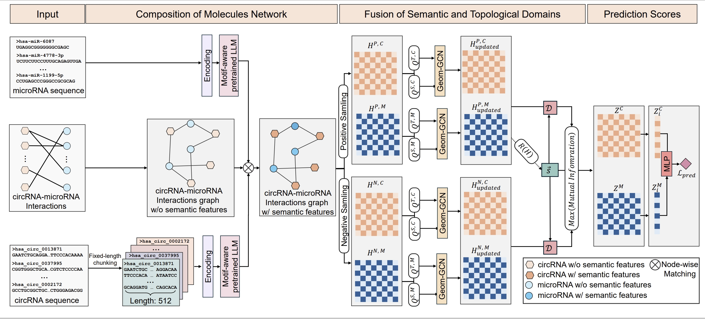
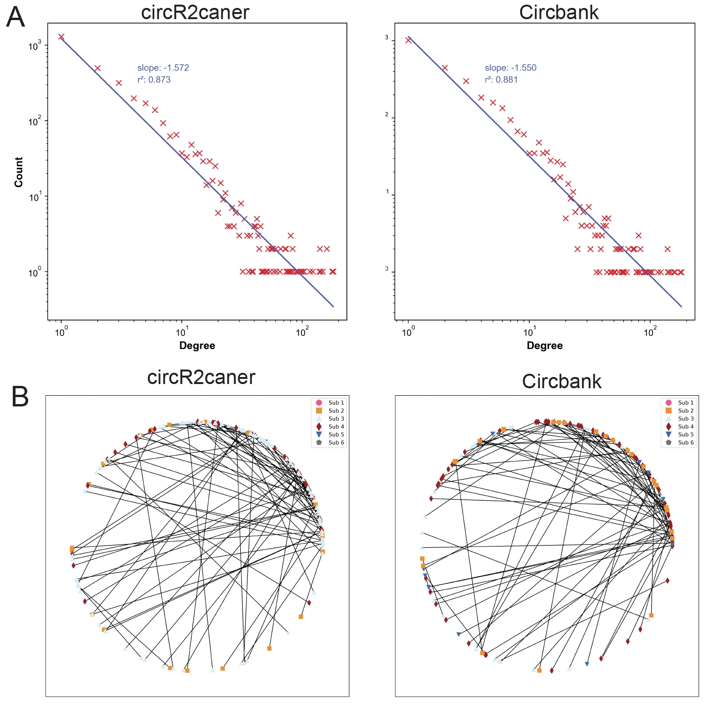

# HGLMALLM
===========================================================================


[](https://www.python.org/)
[](https://pytorch.org/)


Identifying circRNA-microRNA interactions (CMI) is a significant biomedical issue in recent years. This problem provides insights into using circRNA as biomarkers, developing cancer therapies, and creating cancer vaccines. Using computational methods for identification and prediction is a more time-efficient and cost-effective approach. In computational methods, using graphs to represent and explore the CMI is a mainstreamapproach. However, existing relevant methods do not achieve optimal results by utilizing both the semantic information extracted from sequences and the topological information extracted from graph structures. To address this issue, we propose HGLMALLM, a graph contrastive learning method that learns node representation crossing both the semantic domain generated via motif-aware pre-trained LLMs and the topological domain extracted from hierarchical graph structures. Our method effectively addresses the issue in existing Message Passing Neural Network (MPNN) method that edge components losing heterogeneity after multiple iterations. Moreover, this method utilize the heterogeneity of graph which is extended from the traditional bipartite graph to heterogeneous through the semantic domain. Two commonly used datasets were partitioned based on the distribution of node degrees. Then, we benchmarked our method against 
existing methods. In the independent test set evaluation, it achieved a 3% amd 1% improvement on two datasets. Our method demonstrated the best stability in ten-fold cross-validation on the training set. The edge components with fewer than four nodes were separated and conducted tests to validate that our method performs well. A datasets collected from real scenarios was used to demonstrate the strong predictive ability of our method for identifying unidentified CMI.


(Fig. 1.)

## Table of Contents

- [Installation](#installation)
- [Quick start](#quick-start)
- [Contributing](#contributing)
- [Cite](#cite)
- [Contacts](#contacts)
- [License](#license)


## Installation

Our method is tested to work under:

```
* Python 3.8.0
* Torch 1.12.0
* Numpy 1.23.5
* Other basic python toolkits
```
### Installation of other dependencies
* Install [Networkx](https://networkx.github.io/) using ` $ pip install networkx `
* Install [PyG](https://pypi.org/project/torch-geometric/) using ` $ pip install torch-geometric `
```
git clone --recursive https://github.com/microsoft/LightGBM
cd LightGBM
mkdir build
cd build
cmake -A x64 ..
cmake --build . --target ALL_BUILD --config Release
```
* Install [scikit-learn]https://scikit-learn.org/stable/) using '$ pip install -U scikit-learn'

# Quick start
To reproduce our results:

## 1，Extract sequence features via RNA-Ernie

We used RNA-ERNIE as our semantic descriptor, which they have packaged into a Docker container for ease of use. Please find it at the following link:
[RNA-Ernie](https://www.nature.com/articles/s42256-024-00836-4/)
Here, we adopt a fixed-length segmentation approach for circRNA, with each segment being 512 bases long. For microRNA, direct extraction is sufficient, and we use the 768-dimensional hidden state at the CLS position as the semantic representation. Then, we use a two-layer Bi-LSTM to compress the circRNA sequence. The detailed method can be found in the sequence section.

## 2，Embed using graph contrastive after pairwise matching of semantic features with network structures
python3 graph_dgi.py

Then, we use a node-wise approach to map the sequence features to nodes. The subsequent steps are to first embed them into the semantic space and the topological space, then encode them using geom-GCN, and finally train using graph contrastive learning.


## 3，Visualization of results:
There are mutliple choices for visualize the results.
python3  Plot.py 
(Fig. 1.)


# Authors

Jiren Zhou, Boya Ji, Rui Niu, Zhuhong You, Xuequn Shang

# Contacts
If you have any questions or comments, please feel free to email: zhoujiren@nwpu.edu.cn.

# License

[MIT ? Richard McRichface.](../LICENSE)
